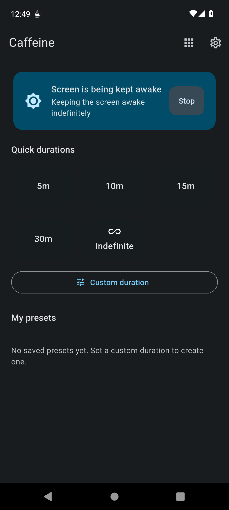
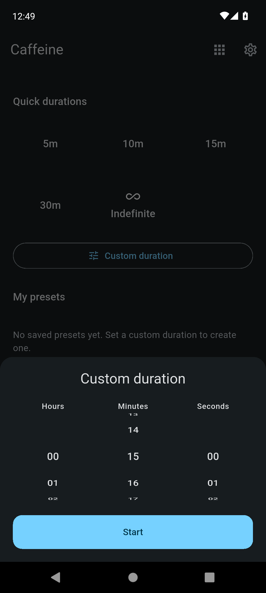
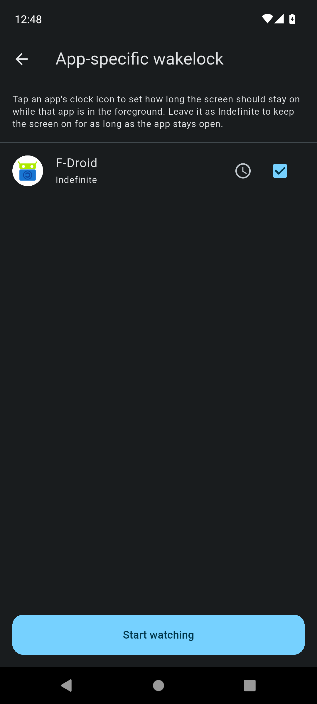
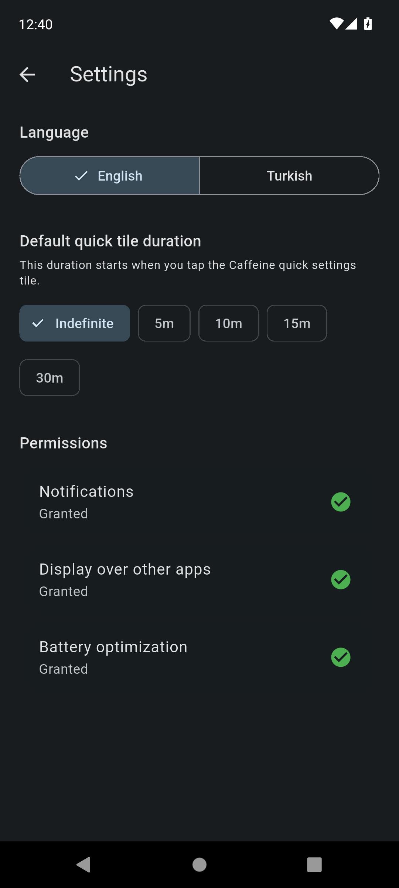

# Caffeine ☕

A simple, open-source screen-wake utility for Android — keep your screen on for a set time, indefinitely, or automatically while a specific app is in the foreground.


## Features

- **Quick durations** — 5, 10, 15, 30 minutes or Indefinite, one tap away
- **Custom duration** — pick hours/minutes/seconds; it's automatically saved as a reusable preset
- **Quick Settings Tile** — toggle the screen-wake from your notification shade; long-press it for a preset picker
- **App-specific wakelock** — pick individual apps (e.g. an e-reader or video app) and the screen stays on only while that app is in the foreground, with an optional per-app time limit
- **Live notification** — shows the remaining time (via the system's own countdown, not a battery-draining timer) with a one-tap Stop action
- **Material You** — on Android 12+, the app's colors and its launcher icon adapt to your wallpaper
- **Turkish & English** — full localization, defaults to English
- **Dark theme**, responsive layout for tablets/large screens

## Screenshots

<p float="left">
  
  
  
  
</p>

## Installation

### F-Droid


[](https://f-droid.org/packages/com.caffeine.timer/)

### GitHub Releases

1. Go to the [Releases](../../releases) page
2. Download the latest `app-release.apk`
3. Install it (you may need to allow "Install unknown apps" for your browser/file manager)

> Releases downloaded from GitHub are signed with the maintainer's own key. If you later install the F-Droid build, you'll need to uninstall the GitHub build first (different signing keys can't be updated over one another).

## Permissions used (and why)

Caffeine only requests what it actually needs, and asks for each permission with an explanation in-app:

| Permission | Why |
|---|---|
| Notifications | Required to show the ongoing "screen is awake" status and Stop button |
| Display over other apps | Used only to reliably keep the screen on via an invisible overlay flag — nothing is ever drawn on top of other apps |
| Ignore battery optimizations | So the timer isn't killed by the system while running in the background |
| Usage Access | Only requested if you use **app-specific wakelock**, to detect when your selected apps are in the foreground. This data never leaves your device |

## Building from source

**Prerequisites:** Flutter (stable channel), JDK 17+/21, Android SDK.

```bash
git clone https://github.com/mehmetemredemir/caffeine.git
cd caffeine
flutter pub get
flutter gen-l10n
dart run flutter_launcher_icons
flutter build apk --release
```

The built APK will be at `build/app/outputs/apk/release/app-release.apk`.

For a signed release build, create `android/key.properties` (see `android/app/build.gradle.kts` for the expected fields) — this file is git-ignored and never committed. Without it, the build falls back to the debug signature, which is also what F-Droid's own build server produces (F-Droid signs the app with its own key).

## Tech stack

- **UI:** Flutter, Riverpod for state management, Hive for local storage
- **Android native:** Kotlin — a `Foreground Service` for the wakelock/timer, `TileService` for the Quick Settings tile, `UsageStatsManager` for app-specific detection, `MethodChannel`/`EventChannel` to bridge Flutter and native code

## Known issues

- App-specific wakelock may not detect the foreground app reliably on some
  devices due to aggressive battery management. Make sure Usage
  Access and "unmonitored app" battery settings are enabled for Caffeine.
  
## Contributing

Issues and pull requests are welcome. Please keep new code and comments in English.

## License

This project is licensed under the [GPL-3.0-or-later](LICENSE)
